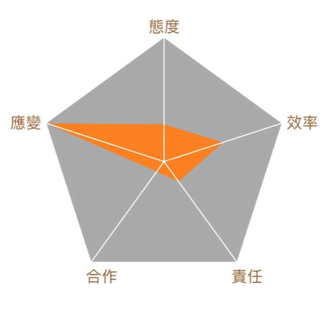

# RadarChart



此程式是可以產生 RadarChart，可自訂要有幾個點。
使用方法：

```swift
radarChartView.padding = 30
// 設定上下需要留多少空間。
    
radarChartView.ratios = [0.3, 0.5, 0.2, 0.1, 1]
// 設定各邊的比率，範圍 0~1。
    
let texts = ["態度", "效率", "責任", "合作", "應變"]
let attr = [NSAttributedStringKey.foregroundColor : UIColor.brown,
            NSAttributedStringKey.font : UIFont.systemFont(ofSize: 15)
]
    
let attrs = texts.map{NSAttributedString(string: $0, attributes: attr)}
radarChartView.vertexTitles = attrs
// 設定各點的標題，
// 順序是 12 點鐘方向第一個，逆時針增加。
    
let offsets = [CGPoint(x:-15, y:-20),
               CGPoint(x:5, y:-10),
               CGPoint(x:-5, y:5),
               CGPoint(x:-5, y:5),
               CGPoint(x:-35, y:-10)]
    
radarChartView.vertexOffsets = offsets
// 設定各點的標題擺放的位置，預設是放在點上，可自行調整 offset。
    
radarChartView.vertexCircleRadius = 0
// 設定各點的半徑。
    
radarChartView.setNeedsDisplay() 
```